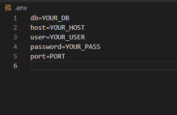

<!-- 
This README describes the package. If you publish this package to pub.dev,
this README's contents appear on the landing page for your package.

For information about how to write a good package README, see the guide for
[writing package pages](https://dart.dev/guides/libraries/writing-package-pages). 

For general information about developing packages, see the Dart guide for
[creating packages](https://dart.dev/guides/libraries/create-library-packages)
and the Flutter guide for
[developing packages and plugins](https://flutter.dev/developing-packages). 
-->
MySQLManager is a dependency thought to be used as a controller for the connection
to a MySQL or MariaDB database. It used the dependency mysql1 as the driver for the database connection.
Connect to your database with only configuring a simple .env file!

## Features

Connect to a MySQL database with a .env file and manage the connection easily. Also,  you can
pass the credentials as a Map, but is much easier to use the .env file.

## Getting started

You only have to setup your .env file at the *root* of your app


Once you have this configuration of above you can read Usage.

## Usage 

```dart
import 'package:mysql_manager/src/mysql_manager.dart';


// ignore: slash_for_doc_comments
/*********************************************
 *                                           *
 *  Visit the test folder at the github repo *
 *  in order to check if your .env file is   *
 *  well configured.                         *
 *  https://github.com/raul94a/mysql_manager *
 *                                           *
 ********************************************/

void main() async{

  //There's two ways to stablish a connection to MySQL using this dependency
  //1. With a .env file 
  //You're suposed to create a .env file at the root of your application
  //This file will have the following structure (adding more properties IS NOT problematic)

          //db=YOUR_DB_NAME
          //host=YOUR_HOST
          //user=YOUR_MYSQL_USER
          //password=YOUR_PASSWORD
          //port=PORT
//Once the .env file contains the credentials you can connect as easy as the following:

//The only way to instanciate MySQLManager is with the instance getter
final MySQLManager manager = MySQLManager.instance;
//initialize the connection. Init method will return a MySqlConnection object
final conn = await manager.init();
//you can pass sql to the query method
final results = await conn.query('select * from test');
//results will be a iterator,so is possible to loop over it
for (var r in results){
  //returns data in Map<String,dynamic> format
  print(r.fields);
}

await conn.close();
//also you can use await manager.close();

//2. Using the configuration map. This method is the same as the first with a little variation
//final conn = await manager.init(false, {'db'='YOUR_DB', 'host': 'YOUR_HOST', 'user':'YOUR_USER', 'password':'YOUR_PASSWORD', 'port': port}); //=> port is an integer, be careful

}
}
```
